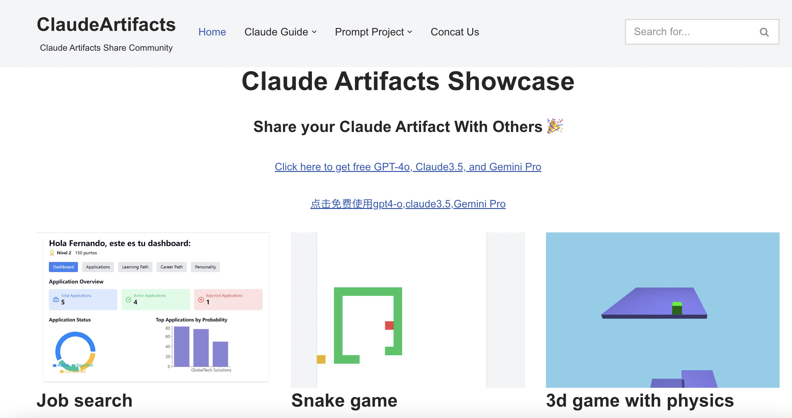

# claude-artifacts
## share claude artifacts case, 
learn more about claude, please visit [claude](https://www.anthropic.com/news/claude-3-5-sonnet)

learn more about claude artifacts, please visit [claude-artifacts](http://assh83.com/)

## Artifacts—a new way to use Claude
Artifacts on Claude.ai, a new feature that expands how users can interact with Claude. When a user asks Claude to generate content like code snippets, text documents, or website designs, these Artifacts appear in a dedicated window alongside their conversation. This creates a dynamic workspace where they can see, edit, and build upon Claude’s creations in real-time, seamlessly integrating AI-generated content into their projects and workflows.
learn more about open artifacts, please visit 

<video src="https://youtu.be/rHqk0ZGb6qo" controls="controls" width="500" height="300">您的浏览器不支持播放该视频！</video>

| case_name | case_cate | case_desc | ViewArtifact | UserLink |
|-----------|-----------|-----------|--------------|----------|
| job search artifact | Tool | I created a job search artifact in Claude, which is a kind of assistant/CRM, and you can use and remix it here: | [ViewArtifact](https://claude.site/artifacts/f829f1ea-a5f1-4459-b447-975fb39d0c19) | [UserLink](https://x.com/CarolMonroe/status/1810723589726818386) |
| snake game | Lifestyle | I created the snake game below using AI that is also played by an AI. Claude Sonnet 3.5 is magic. Test it using this link and remix it. Let's see if we can make the AI win it! | [ViewArtifact](https://t.co/5pFX8M5mou) | [UserLink](https://x.com/mmnopqrs/status/1810744235114779083) |
| 3d game with physics | Game | Here is a 3d game with physics I made in a few prompts with claude | [ViewArtifact](https://claude.site/artifacts/5dcd7214-289c-499f-9cf3-4ea6bf34eadb) | [UserLink]() |
| Worms-like game | Game | Click to view it then you get a full-screen version of the app with the option to remix. BTW the game is completely unfinished. It kinda works but not very well. :-) | [ViewArtifact](https://t.co/QNEejBINUT) | [UserLink](https://x.com/koltregaskes/status/1810704328551735773) |
| A word cloud Generator | Creative | A word cloud Generator just input a url | [ViewArtifact](https://t.co/FftvUeLrqa) | [UserLink](https://x.com/ekpodar/status/1810708749201420687) |
| EXAMPLE | Programming | Double pendulum physics simulator. If you change the initial angle you can switch between regular and chaotic motion. Give it a try! | [ViewArtifact](https://claude.site/artifacts/5a0d58eb-718b-4cf7-a047-d223940702a4) | [UserLink](https://x.com/EducatingwithAI/status/1810727247575441864) |
| Claw'd's Closet | Game | Claw'd's demo game | [ViewArtifact](https://t.co/5c2mrennmO) | [UserLink]() |
| Web Demo | Programming | cool website design | [ViewArtifact](https://claude.site/artifacts/b983aee7-7df9-4e99-8ac5-8fd32f3926e0) | [UserLink]() |
| BCG Matrix visualizations | Creative | BCG Matrix visualizations | [ViewArtifact](https://claude.site/artifacts/9ed2d04e-1dc2-4533-ae85-d74d81aedd80) | [UserLink](https://x.com/kidehen/status/1810840766069006748) |
| Connect4 Game | Game | Connect4 Game | [ViewArtifact](https://t.co/r90GC98ouK) | [UserLink](https://x.com/RaemondBW/status/1810753714778689628) |
| Azure | Programming | Azure Website Demo | [ViewArtifact](https://claude.site/artifacts/4d9134ff-7034-4ced-862a-13c0ccacd6f1) | [UserLink](https://x.com/ekpodar/status/1810840979231875418) |
| Google Cloud | Programming | Web Design of Google Cloud | [ViewArtifact](https://t.co/yL8n2G6rpr) | [UserLink](https://x.com/ekpodar/status/1810840979231875418) |
| AWS | Programming | Web Design of AWS | [ViewArtifact](https://t.co/srnbyyxYmX) | [UserLink](https://x.com/ekpodar/status/1810840979231875418) |
| Buzzle Game | Game | Buzzle Game | [ViewArtifact](https://claude.site/artifacts/0f344773-ecee-4c95-aabf-86ca35b2a6e0) | [UserLink](https://x.com/gimu_ai/status/1810801830622024168) |
| Product Framework Assistant | Creative | PMs, how do you envision using this tool in your day-to-day work? | [ViewArtifact](https://t.co/f3ZelKHT7P) | [UserLink]() |
| BTC | Creative | BTC Design | [ViewArtifact](https://t.co/YRArle4u0B) | [UserLink](https://x.com/jammaru_lab) |
| Space Jam | Game | Space Jam | [ViewArtifact](https://t.co/5H2Rys1ejY) | [UserLink]() |
| Pomodoro Timer | Creative | Pomodoro Timer Web Design | [ViewArtifact](https://t.co/qF0C8IG0Tl) | [UserLink]() |
| Car Game | Game | Car game for 5 year old  \[View Artifact]\(<https://claude.site/artifacts/d582516d-48b7-46df-bfde-> deb8def69126)[User Link](https://x.com/EricBuess)  2024-07-10  ### Web Design of Artifacts Release  Web Design  A beautiful Web design of Claude Artifacts | [ViewArtifact](https://claude.site/artifacts/49e049b1-4173-4541-a79f-313e38f67a84) | [UserLink](https://x.com/JeremyDanielFox) |
| Space X Landed Game | Game | Space X Landed Game | [ViewArtifact](https://claude.site/artifacts/590d0d2a-da07-4a08-9c83-2d3d11b4f63f) | [UserLink](https://x.com/alexalbert__) |
| Claw'd's Closet | Game | Claude Demo Game | [ViewArtifact](https://claude.site/artifacts/c55cf857-d456-4520-8ee2-206697dfa2a3) | [UserLink]() |
| easy2resume | Tool | easy2resume | [ViewArtifact](https://claude.site/artifacts/54d2be18-8553-4bdb-858e-53dd43887de2) | [UserLink]() |
| Fancy audio player | Creative | A web based audio player, which display some fancy visualization and stats about the audio | [ViewArtifact](https://claude.site/artifacts/2ab9d4ac-06c5-4a0d-a171-5e994f4e114e) | [UserLink]() |
| EAR-DRUMS | Drum Pad | Creative | EAR-DRUMS is an interactive, browser-based drum machine that allows users to create and manipulate beat sequences in real-time. With its intuitive interface featuring colorful pads, customizable loops, and a dynamic visualizer, EAR-DRUMS offers both beginners and seasoned musicians a fun and accessible way to explore rhythm and create unique percussion patterns. | [ViewArtifact](https://claude.site/artifacts/0e4935b1-bffc-452c-8104-e00294659d99) | [UserLink](https://www.instagram.com/isaiart) |
| 8 Beat Drum | Creative | 8 Beat drum with looping, visualizer, BPM, and Volume sliders! | [ViewArtifact](https://claude.site/artifacts/0eff2273-2585-4289-81d6-89164c36c21a) | [UserLink](https://www.instagram.com/isaiart) |
| 2048 mini-game | Game | 2048 is a single-player sliding block puzzle game created by Italian web developer Gabriele Cirulli in 2014 | [ViewArtifact](https://claude.site/artifacts/767bdab7-a340-441c-a310-885b1c399c29) | [UserLink]() |
| Minesweeper | Game | Minesweeper: A puzzle game on a 15x15 grid with 35 hidden mines. Left-click to reveal cells, right-click to flag mines. Clear all safe cells to win. Features include safe first click, chord action, and time tracking. Challenge yourself to clear the board quickly! | [ViewArtifact](https://claude.site/artifacts/75e17dd0-541d-487d-b729-8efc4e992544) | [UserLink](https://christorng.substack.com/) |
| participle phrase game for Taiwanese senior high school students | Education | The first Claude artifact interactive game for my senior high school students in Taiwan. It's just a beginning. | [ViewArtifact](https://claude.site/artifacts/ac7f8da8-e6d7-4825-98a9-223f6f25a945) | [UserLink]() |
| 超级马里奥 | Game | 一个好玩的游戏 | [ViewArtifact](https://claude.site/artifacts/47ffed7b-ad2e-4259-b071-414f42d585e2) | [UserLink]() |
| 2048 Game | Game | 2048 Game | [ViewArtifact](https://claude.site/artifacts/2f40d1b3-04cc-4f04-9acf-221a28480eb6) | [UserLink]() |
| 鋼胚軋延模擬遊戲(Slab Mill Simulation Game) | Game | 調整軋輥間隙,時間內將鋼胚軋至指定厚度(Adjust the roll gap and roll the steel billet to the specified thickness within the designated time.) | [ViewArtifact](https://claude.site/artifacts/eb148997-d037-4c2a-92d8-f31d9521db3d) | [UserLink]() |
| Mandelbrot Visualizer | Creative | An interactive, customizable visualization of the Mandelbrot set that let's you go on a fractal ride. | [ViewArtifact](https://claude.site/artifacts/6d5a3bed-5f60-444f-a6de-d3e9ea8fe295) | [UserLink](https://claudeartifacts.com/patrickfreyer.com) |
| Worm.io Battle | Game | as a worm you must survive and to be eaten | [ViewArtifact](https://claude.site/artifacts/ec04caf6-aff6-4699-b76d-a3b3b4a265b2) | [UserLink]() |
| Sales - order entry calculator | Tool | Order entry calculator | [ViewArtifact](https://claude.site/artifacts/00960afc-e09e-4471-b344-5497791880f8) | [UserLink](https://claudeartifacts.com/@writson) |
| High school exam countdown timer | Education | countdown timer for Taiwanese GSAT (General Scholastic Ability Test) and CAP (Comprehensive Assessment Program for Junior High School Students) 2025 | [ViewArtifact](https://claude.site/artifacts/eabdd426-239a-4d05-b8e4-9d7b6f7b7806) | [UserLink]() |
| youtube video downlaoder | Tool | This is a YouTube video downloader this is only a basic level design open this and improve this, please.  \[View Artifact]\(<https://claude.site/artifacts/3cf67570-ed9c-43fc-aaed-> cecf4cd85ebe)  2024-07-16  ### 日文代码雨  Web Design  日文代码雨 | [ViewArtifact](https://claude.site/artifacts/c11b79e6-2e04-4b59-8875-fd0c6c7078d2) | [UserLink]() |
| Advance BMI calculator | Lifestyle | you can use this tool to calculate your BMI (it is a medical screening tool that estimates body fat percentage by comparing a person's weight to their height) Score using the advanced technique. | [ViewArtifact](https://claude.site/artifacts/6fd95417-f0cd-4f4c-b9a2-a31a80982ca9) | [UserLink]() |